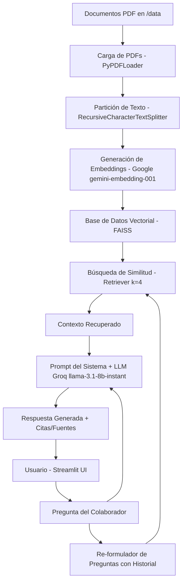

# BimBam Buy - Agente Corporativo de IA (RAG)

Este repositorio contiene la solución para el **Challenge de Oracle ONE y Alura Latam**. El proyecto consiste en el desarrollo y despliegue de un **Agente Corporativo de Inteligencia Artificial basado en RAG (Retrieval-Augmented Generation)** para la empresa ficticia **BimBam Buy**, un e-commerce multiplataforma.

El agente está diseñado para resolver consultas de colaboradores y soporte interno basándose estrictamente en cinco documentos PDF oficiales de la empresa:
1. **Política de Reembolsos y Devoluciones**
2. **Guía de tiempos y Costos de Envío**
3. **Preguntas Frecuentes sobre Métodos de Pago**
4. **Manual de Garantía de Productos**
5. **Programa de Afiliados**

---

## 🏗️ Arquitectura del Sistema

El agente utiliza una arquitectura RAG estándar para asegurar respuestas precisas, contextualizadas y libres de alucinaciones:



### Componentes Clave:
*   **LLM (Modelo de Lenguaje):** `llama-3.1-8b-instant` hospedado en **Groq** para inferencia ultra-rápida, latencia mínima y costo eficiente.
*   **Embeddings:** `gemini-embedding-001` de **Google** para una representación semántica robusta del idioma español.
*   **Base de Datos Vectorial:** **FAISS** (Facebook AI Similarity Search) para almacenamiento y búsqueda de similitud rápida en local.
*   **Orquestador RAG:** **LangChain** y **LangChain Classic** para la estructuración de chains con memoria contextual.
*   **Interfaz de Usuario:** **Streamlit** con personalización de estilos premium (Glassmorphism & Neon accents) y renderizado detallado de fuentes.

---

## 🛠️ Tecnologías Utilizadas

*   **Python** 3.12.10
*   **LangChain / LangChain Classic / LangChain Community**
*   **LangChain Google GenAI** (embeddings)
*   **LangChain Groq** (LLM)
*   **FAISS CPU**
*   **PyPDF**
*   **Streamlit**
*   **Python Dotenv**

---

## 🚀 Instrucciones de Configuración y Ejecución Local

### 1. Clonar el repositorio
```bash
git clone https://github.com/tu-usuario/bimbam-buy-agent.git
cd bimbam-buy-agent
```

### 2. Configurar el Entorno Virtual
Crea y activa un entorno virtual en Python:
*   **Windows (PowerShell):**
    ```powershell
    python -m venv .venv
    .venv\Scripts\Activate.ps1
    ```
*   **Linux / macOS:**
    ```bash
    python3 -m venv .venv
    source .venv/bin/activate
    ```

### 3. Instalar las Dependencias
```bash
pip install -r requirements.txt
```

### 4. Configurar Variables de Entorno
Crea un archivo `.env` en la raíz del proyecto con la siguiente estructura:
```env
GOOGLE_API_KEY=tu_google_api_key
GROQ_API_KEY=tu_groq_api_key
GROQ_MODEL=llama-3.1-8b-instant
```

### 5. Generar el Índice Vectorial (FAISS)
Ejecuta el script para procesar los PDFs corporativos, fragmentar el texto, generar los embeddings e indexar la información:
```bash
python vector_builder.py
```
> **Nota:** El script cuenta con procesamiento por lotes y pausas de seguridad (sleep timers) para evitar errores de tasa límite (429 Rate Limits) de la cuota gratuita de la API de Google.

### 6. Ejecutar la Aplicación Streamlit
```bash
streamlit run app.py
```

---

## 🌐 Despliegue en Oracle Cloud Infrastructure (OCI)

El agente está diseñado para desplegarse en una **VM Compute Instance** de la capa gratuita permanente de **Oracle Cloud Infrastructure (OCI Compute)**.

### Pasos para el Despliegue:

1.  **Crear Instancia de VM en OCI:**
    *   **SO:** Ubuntu 22.04 LTS o AlmaLinux.
    *   **Shape:** `VM.Standard.E4.Flex` (capa siempre gratuita).
2.  **Configurar Reglas de Red (VCN):**
    *   Ingresar a la VCN de la instancia.
    *   Agregar una **Regla de Ingreso (Ingress Rule)** en la lista de seguridad para permitir tráfico en el puerto `8501` (Puerto por defecto de Streamlit).
    *   *Detalles de Regla:* IP Origen: `0.0.0.0/0`, Protocolo IP: `TCP`, Rango de puertos de destino: `8501`.
3.  **Configurar el Firewall del Sistema Operativo de la VM:**
    *   Abrir el puerto `8501` localmente:
        ```bash
        sudo ufw allow 8501/tcp
        ```
4.  **Clonar y configurar el código:**
    *   Conectarse por SSH a la VM.
    *   Instalar git, python3 y pip.
    *   Clonar este repositorio, crear el entorno virtual, configurar las variables de entorno en `.env` y ejecutar `vector_builder.py`.
5.  **Ejecutar Streamlit en Segundo Plano:**
    *   Usar `tmux` o `nohup` para mantener viva la aplicación al desconectar la sesión SSH:
        ```bash
        nohup python -m streamlit run app.py --server.port 8501 --server.address 0.0.0.0 > streamlit.log 2>&1 &
        ```

---

## 💬 Ejemplos de Preguntas y Respuestas (Evidencias de Funcionamiento)

El prompt del sistema de BimBam Buy restringe al agente para responder **estrictamente** con el contexto de los documentos provistos, manteniendo coherencia de marca.

### Ejemplo 1: Consulta de Devolución
*   **Pregunta:** *¿Cuáles son los plazos para solicitar un reembolso?*
*   **Respuesta del Agente:** 
    > Según nuestra política de devolución, los plazos para solicitar un reembolso son:
    > *   **Retracto:** Dentro de los 10 días corridos posteriores a la recepción del pedido (Sección 5.1).
    > *   **Producto incorrecto, faltante o daño visible:** Dentro de las 48 horas posteriores a la entrega, adjuntando evidencia fotográfica o video (Sección 5.2).
    > *   **Falla de funcionamiento:** Dentro del período de garantía aplicable conforme al Manual de Garantía de BimBam Buy (Sección 5.3).
*   **Fuente consultada:** `Politica de Reembolsos y Devoluciones de BimBam Buy.pdf` (Página 2 y 4).

### Ejemplo 2: Consulta sobre Afiliados
*   **Pregunta:** *¿Cómo funciona el programa de afiliados y qué comisiones se pagan?*
*   **Respuesta del Agente:** 
    > El programa de afiliados funciona atribuyendo comisiones por ventas validadas mediante enlaces rastreables. Las comisiones varían según la categoría de producto y se pagan de acuerdo con el porcentaje estipulado tras la confirmación de pago y ausencia de reembolsos.
*   **Fuente consultada:** `Programa de Afiliados de BimBam Buy.pdf` (Página 7).

### Ejemplo 3: Pregunta fuera de contexto (Medida de Seguridad contra Alucinaciones)
*   **Pregunta:** *¿Cómo hago para hacer una lasaña de carne?*
*   **Respuesta del Agente:**
    > *Lo siento, como asistente corporativo de BimBam Buy no tengo información al respecto en mis documentos oficiales. Por favor contacta al área correspondiente.*
*   **Comportamiento esperado:** El agente bloquea la consulta y evita alucinaciones o desvíos del rol corporativo.
